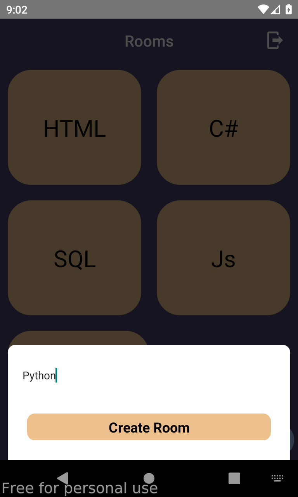
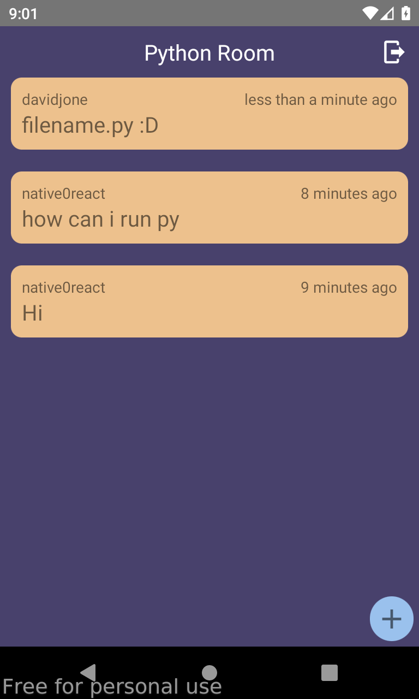
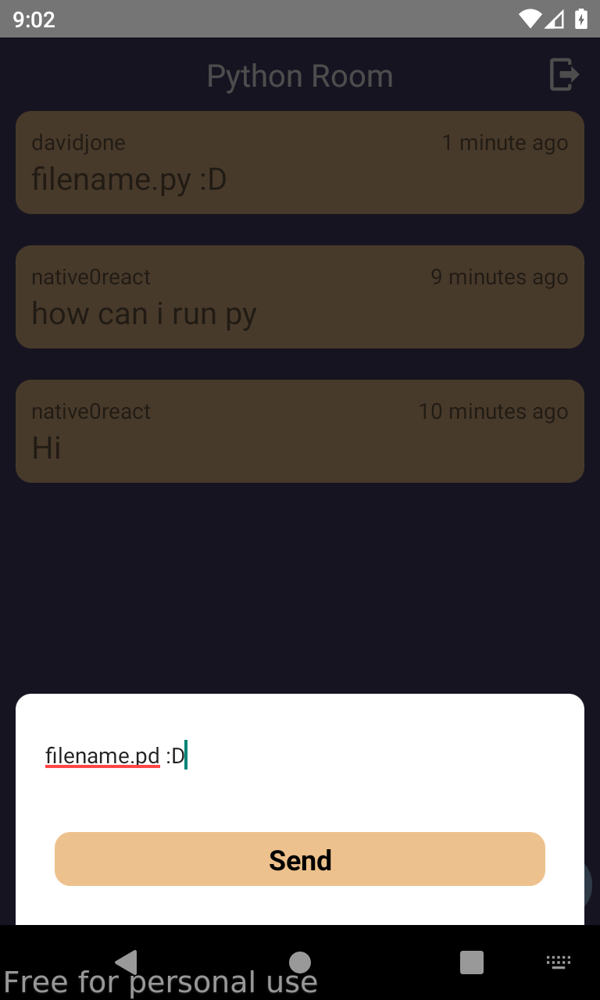

# ChatChat App
      

## Tools

- Firebase
- react-native-google-signin
- react-navigation
- date-fns,
- formik
- react-native-flash-message
- react-native-modal
- react-native-onboarding-swiper
- react-native-vector-icons
- yup
